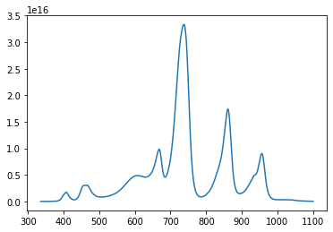

# pyAvantes
This python package allows you to view and parse Avantes raw8 spectrum

## Example
```python
import os
import numpy as np
import matplotlib.pyplot as plt
from datetime import datetime
%matplotlib inline
import pyAvantes

path = os.path.abspath(pyAvantes.__path__[0]+r'\..\doc\example.Raw8')
S = pyAvantes.Raw8(path)
fig, ax = plt.subplots(1,1,figsize=(10,7))
fig.patch.set_facecolor('white')
ax.plot(S.getWavelength(),S.getRelativeIrradiance());
```
    
